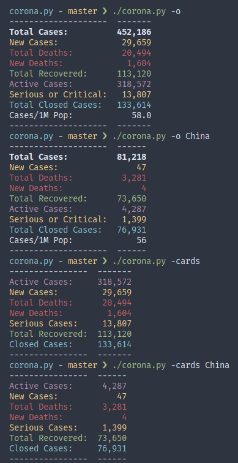

# `corona.py`

A Python script that tries to provide up-to-date data about the Coronavirus outbreak. It scrapes the [Worldometers](https://www.worldometers.info/coronavirus/) site for information. So, the information should be accurate. However, I'm not to be held responsible for any inaccuracies should they exist.

The output is colored, tabulated and easily understood. There is also a basic form of caching so that you get to view previously downloaded statistics even if you have no network access.

## Usage

* No arguments : Shows overall data of the World. You can also give `country` as 'total:' and get the same result.
* Only `country` : Shows overall data of the country
* `--offline (-o)` : Uses pre-downloaded cache for the outbreak data if possible.
* `--news (-n)` : Gives news such as recent infections and other major events. It can take an argument in the form of an integer 'n' or the form 'm:n' where m and n are integers. If only 'n' is given without a colon, the latest 'n' news is printed. When a colon is used, it behaves similar to slicing in Python, so ':n' is equivalent to just 'n', 'm:' gives the earliest news of the day starting from the mth item and 'm:n' gives all news between the mth item and nth item. Passing just 'a' as an argument will only print the most important news (denoted by an alert or warning icon).
* `--table (-t)` : Gives the complete table of infected countries and related details. Can be sliced just like '--news'.
* `--sort`: Only useful when used alongside `--table`. Choose how to sort the data when presenting. Possible choices are:
  * `c`: Cases
  * `nc`: New Cases
  * `d`: Deaths
  * `nd`: New Deaths
  * `r`: Recovered
  * `a`: Active
  * `s`: Serious
  * `n`: Name of Country from Z-A
  * Adding `a` to the end of any of them will sort the list in the opposite order.
  * If none of the above, it automatically defaults to sorting by Cases.
* `--latest (-l)` : Shows the total events today, i.e. new cases and deaths. If `country` is given, it is limited to the country's statistics.
* `--active (-a)` : Shows the number of active cases. If `country` is given, it is limited to the country's statistics.
* `--closed (-c)` : Shows the number of closed cases. If `country` is given, it is limited to the country's statistics.
* `--dead (-d)` : Shows the number of patients dead. If `country` is given, it is limited to the country's statistics.
* `--recovered (-r)` : Shows the number of recovered patients. If `country` is given, it is limited to the country's statistics.
* `--serious (-s)` : Shows the number of patients in critical or serious condition. If `country` is given, it is limited to the country's statistics.

## Dependencies

`corona.py` depends on:

* python-appdirs : for caching data
* python-beautifulsoup4 : for parsing data
* python-pandas : for proper storage, access and management of tabular data
* python-requests : for obtaining data
* python-tabulate : for prettifying data
